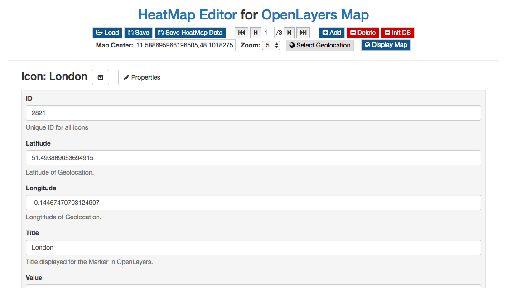

# openlayer_heatmap
Generate XML-Data for OpenLayers Heatmap based on JSON-Editor.

## [Demo HeatMap Editor](https://niebert.github.io/openlayer_heatmap/)

## [Demo Markers Display](https://niebert.github.io/openlayer_display_markers/)

## Derivative Works of OpenLayers: Icon Symbolizer
The repository is based on the [OpenLayers example](http://openlayers.org/en/latest/examples/icon.html)

## LinkParameter Library: linkparam.js
This library allows to submit the marker data via URL parameter. Furthermore you can submit the zoom factor of the map and the map centre.

* Library: * [Download LinkParam.zip](https://github.com/niebert/LinkParameter/archive/master.zip)

## Other related GitHub Project
* [OpenLayers Select Geolocation](https://github.com/niebert/openlayer_selectlocation) -- [WebApp](https:/niebert.github.io/openlayer_selectlocation)
* [Mapper for Sustainable Devlopment Goals](https://github.com/niebert/Mapper4SDG) -- [WebApp](https:/niebert.github.io/Mapper4SDG)

### Demo
* [Geolocation Select Demo](https://niebert.github.io/openlayer_display_markers)
* [Download Display Markers Demo](https://github.com/niebert/openlayer_display_markers/archive/master.zip) unzip file and checkout the subdirectory ___/docs___. The demo is stored in ___/docs___ because it is used at the same time as root directory for https://niebert.github.io/openlayer_display_markers
* [Download Select Location Demo](https://github.com/niebert/openlayer_selectlocation/archive/master.zip) unzip file and checkout the subdirectory ___/docs___. The demo is stored in ___/docs___ because it is used at the same time as root directory for https://niebert.github.io/openlayer_selectlocation
