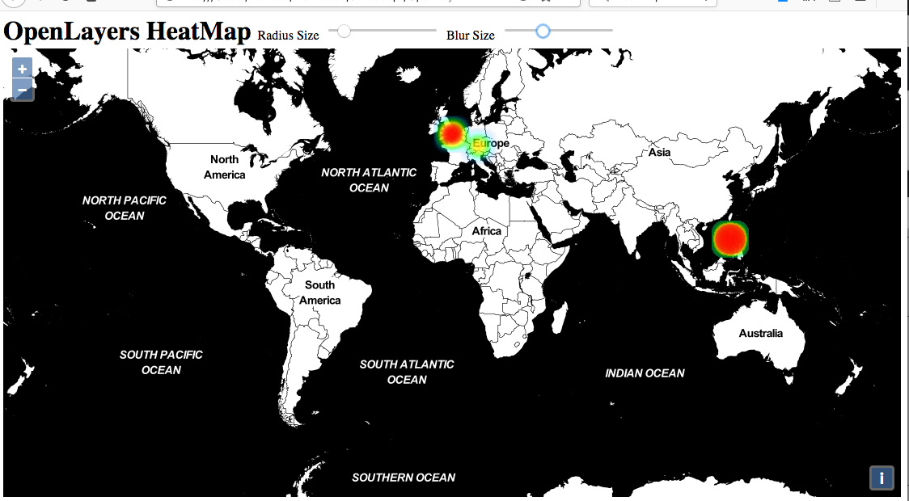

# Heatmap Editor for OpenLayers
Generate XML-Data for OpenLayers Heatmap based on JSON-Editor.

## [Demo HeatMap Editor](https://niebert.github.io/openlayer_heatmap/)

## [Demo Markers Display](https://niebert.github.io/openlayer_display_markers/)

## Workflow to Create a Heatmap
* [Download openlayer_heatmap.zip](https://github.com/niebert/openlayer_heatmap/archive/master.zip) and unzip to a folder of your choice (e.g. `Documents/openlayer_heatmap`).
* Check out the example heatmap in (e.g. `Documents/openlayer_heatmap/HeatMap/index.html`)
* Start [HeatMap Editor](https://niebert.github.io/openlayer_heatmap/)
* Add a new record to heatmap database by pressing the `Add`-button
* Press `Select Geolocation`-button, zoom in and find Rome in Italy and click of Rome in the map (the geolocation is selected).
* After the selected geolocation is return to the HeatMap editor, set the name `Rome` and the value `20`.
* Save the JSON-file for further editing or sharing the data with others (because data is stored in the browser only).ou will find a file `mapobject.json` in your Download Folder of the browser.
* Save heatmap XML data by pressing `Save HeatMap Data`. You will find a file `heatmap_data.kml` in your Download Folder of the browser. There might be more than one file. The browser might enumerate the files `heatmap_data_3.kml`. Copy the file to `Documents/openlayer_heatmap/HeatMap/heatmap_data.kml`. If the file contains a number rename the file.
* Start `Documents/openlayer_heatmap/HeatMap/index.html` again to see you new heatmap.

## Wikiversity Learning Resource
This [WebApp](https://en.wikiversity.org/wiki/AppLSAC) was generated for the following Wikiversity Learning Resource about heatmaps:

 https://en.wikiversity.org/wiki/Heatmap

## Derivative Works of OpenLayers: Icon Symbolizer
The repository is based on the [OpenLayers HeatMap example](https://openlayers.org/en/latest/examples/heatmap-earthquakes.html)

## LinkParameter Library: linkparam.js
This library allows to submit the marker data via URL parameter. Furthermore you can submit the zoom factor of the map and the map centre.

* Library: * [Download LinkParam.zip](https://github.com/niebert/LinkParameter/archive/master.zip)

## Other related GitHub Project
* [OpenLayers Select Geolocation](https://github.com/niebert/openlayer_selectlocation) -- [WebApp](https:/niebert.github.io/openlayer_selectlocation)
* [Mapper for Sustainable Devlopment Goals](https://github.com/niebert/Mapper4SDG) -- [WebApp](https:/niebert.github.io/Mapper4SDG)

### Demo
* [Geolocation Select Demo](https://niebert.github.io/openlayer_display_markers)
* [Download Display Markers Demo](https://github.com/niebert/openlayer_display_markers/archive/master.zip) unzip file and checkout the subdirectory `/docs`. The demo is stored in `/docs` because it is used at the same time as root directory for https://niebert.github.io/openlayer_display_markers
* [Download Select Location Demo](https://github.com/niebert/openlayer_selectlocation/archive/master.zip) unzip file and checkout the subdirectory `/docs`. The demo is stored in `/docs` because it is used at the same time as root directory for https://niebert.github.io/openlayer_selectlocation
